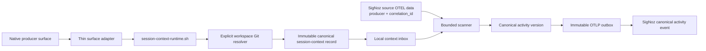

# Session-context capture

`session-context-runtime.sh` is the sole shared project-identity and canonical-record runtime. Surface integrations live in `adapters/<producer>/`; they extract only authoritative native metadata and then invoke this runtime.

## Layout

```text
scripts/
├── session-context-runtime.sh        # canonical validation, Git resolution, and inbox write
├── README.md                          # shared contract and SigNoz data flow
└── adapters/
    ├── claude-code/                   # Claude Code hook adapter
    ├── codex-cli/                     # Codex CLI notify adapter
    ├── codex-app-server/              # Desktop installer, proxy, and adapter
    └── omp/                           # OMP extension adapter
```

## From native surface to SigNoz



The scanner joins accepted context to source telemetry by the exact `(producer, correlation_id)` pair. `correlation_id` must equal the native session identifier proven for that surface; the runtime never derives it from prompts, telemetry content, CWD, process state, or local artifacts.

## Central record schema

```ts
type SessionContextEvent = {
  event_id: string // SHA-256 of producer, session ID, event type, time, and Git root
  producer: "claude-code" | "codex-cli" | "codex-app-server" | "omp"
  session_id: string
  event_type:
    | "session_start"
    | "workspace_changed"
    | "session_end"
    | "session_context" // Codex CLI only
  occurred_at: string // RFC3339 with an offset
  agent: {
    project: {
      id: string // SHA-256 of the normalized Git root
      name: string
      root: string // normalized absolute Git root
      kind: "git"
    }
  }
}
```

`session_context` records are non-temporal Codex CLI project evidence. The other event types produce project intervals. Every adapter must pass exactly `PRODUCER SESSION_ID EVENT_TYPE OCCURRED_AT WORKSPACE`; only the shared runtime resolves the Git root, derives IDs, and writes the schema.
