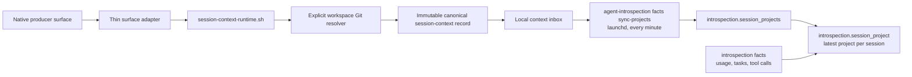

# Session-context capture

`session-context-runtime.sh` is the sole shared project-identity and canonical-record runtime. Surface integrations live in `adapters/<producer>/`; they extract only authoritative native metadata and then invoke this runtime.

## Layout

```text
scripts/
├── session-context-runtime.sh        # canonical validation, Git resolution, and inbox write
├── activity-shim.sh                  # activity hooks: detach `agent-introspection hook`
├── README.md                          # shared contract and SigNoz data flow
└── adapters/
    ├── claude-code/                   # Claude Code hook adapter, install-activity.py
    ├── codex-cli/                     # Codex CLI notify adapter
    ├── codex-app-server/              # Desktop global hook installer and adapter
    └── omp/                           # OMP extension adapter, activity.ts
```

## From native surface to the dashboard facts


```mermaid
flowchart LR
    native[Native producer surface] --> adapter[Thin surface adapter]
    adapter --> runtime[session-context-runtime.sh]
    runtime --> git[Explicit workspace Git resolver]
    git --> record[Immutable canonical session-context record]
    record --> inbox[Local context inbox]
    inbox --> sync[agent-introspection facts sync-projects\nlaunchd, every minute]
    sync --> table[introspection.session_projects]
    table --> view[introspection.session_project\nlatest project per session]
    facts[introspection facts\nusage, tasks, tool calls] --> view
```

`facts sync-projects` inserts each inbox record into ClickHouse and removes the file once it is stored. The dashboard joins facts to `session_project` by session ID, which is the producer-native session identifier (`session.id`, Codex thread/conversation ID, `gen_ai.conversation.id`). `correlation_id` must equal the native session identifier proven for that surface; the runtime never derives it from prompts, telemetry content, CWD, process state, or local artifacts.

## Central record schema

```ts
type SessionContextEvent = {
  event_id: string // SHA-256 of producer, session ID, event type, time, and Git root
  producer: "claude-code" | "codex-cli" | "codex-app-server" | "omp"
  session_id: string
  event_type:
    | "session_start"
    | "workspace_changed"
    | "session_end"
    | "session_context" // Codex CLI only
  occurred_at: string // RFC3339 with an offset
  agent: {
    project: {
      id: string // SHA-256 of "git\0" + the normalized Git root
      name: string
      root: string // normalized absolute Git root
      kind: "git"
    }
  }
}
```

`session_context` records are Codex CLI project evidence from its `notify` hook. The dashboard takes each session's latest recorded project (`introspection.session_project`, `argMax` by time); no intervals are computed. Codex app-server and exec sessions are attributed through the same Codex CLI `notify` hook, because the three surfaces share session IDs. Every adapter must pass exactly `PRODUCER SESSION_ID EVENT_TYPE OCCURRED_AT WORKSPACE`; only the shared runtime resolves the Git root, derives IDs, and writes the schema.

## Codex app-server hook integration

Codex Desktop uses the canonical `codex-app-server` producer. Its installer, `adapters/codex-app-server/install.py`, installs the managed `adapter.py` beside the shared runtime and merges documented global hooks into `<codex-root>/hooks.json`, where `<codex-root>` is `$CODEX_HOME` when it is set to a non-empty absolute path and otherwise `~/.codex`; trust state is at `<codex-root>/config.toml`. The merge preserves unrelated hooks. Installation requires interactive trust; trust state is never written programmatically.

The installer-owned hooks are `SessionStart` with matcher `^(startup|resume|clear|compact)$` and `SessionEnd` with matcher `^other$`. The adapter accepts one hook JSON object on standard input and reads only documented `hook_event_name`, `session_id`, and absolute `cwd`, plus `source` for `SessionStart` or `reason` for `SessionEnd`. It never reads `transcript_path`, prompts, responses, or arbitrary payload fields.

`SessionStart` maps only to `session_start`; `SessionEnd` maps only to `session_end`. Because this envelope has no timestamp, the adapter captures synchronous UTC RFC3339 invocation time and execs the shared runtime with `codex-app-server SESSION_ID EVENT_TYPE OCCURRED_AT WORKSPACE`. The native session ID and cwd remain exact. Codex app-server does not support mid-thread project changes.

## Activity hooks

Activity hooks are a second, separate integration: they close dashboard signals the
producers' own telemetry lacks (tool arguments for Claude Code and omp, reasoning
tokens, approvals, retries, steers, and omp's prompt event). The contract, record schema,
and derivations are in [`docs/hook-events.md`](../../../../docs/hook-events.md).

```text
harness hook ─> activity-shim.sh PRODUCER EVENT ─> agent-introspection hook PRODUCER EVENT (detached)
  ─> ~/.local/share/agent-introspection/session-context-inbox/<event_id>.json
  ─> facts sync ─> introspection.hook_events
```

- `activity-shim.sh` reads the whole envelope from stdin, pipes it to a detached
  `agent-introspection hook` (no temporary file), prints nothing, and exits 0, so a
  hook never blocks or decides anything for the harness. It finds the CLI at
  `$AGENT_INTROSPECTION_BIN`, on `PATH`, or at `~/.local/bin/agent-introspection`.
- **Read:** tool name and arguments, tool error text, prompt length, and (Claude
  `Stop`) the numeric usage and model of the turn's assistant messages in the
  transcript.
- **Never stored:** prompt, argument, output, or error text. Records keep lengths,
  a 16-hex argument hash, command head/subcommand, home-redacted target paths, and a
  digit-normalized failure signature. Prompt labels come from the producers' prompt
  export instead (`docs/hook-events.md`, Prompt export).
- Failures are logged by exception type only to
  `~/.local/share/agent-introspection/hooks.log`.

Install or remove (the installer copies the shim to `~/.local/lib/agent-introspection/session-context-runtime-v1/`,
backs the config up as `<file>.bak-<UTC timestamp>` before a change, is idempotent,
and keeps every other hook):

```sh
python3 adapters/claude-code/install-activity.py --dry-run   # show the diff
python3 adapters/claude-code/install-activity.py             # ~/.claude/settings.json
python3 adapters/claude-code/install-activity.py --remove
```

Codex has no activity hook; its signals are native.

omp has no installer; see [`adapters/omp/README.md`](adapters/omp/README.md#activity-hooks).
