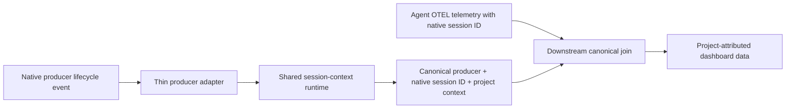

# Project Attribution Failure Investigation Plan

## Objective

Verify and restore the established canonical project-attribution design:

1. thin producer adapters forward an authoritative native session identity and workspace to one shared runtime;
2. the shared runtime validates Git project identity and publishes an immutable session-to-project context record;
3. downstream telemetry queries join the canonical producer and native session ID to that context record so the dashboard can assign the project;
4. every eligible telemetry record from every supported installed producer is attributed exactly once or fails with one evidence-backed cause.

The investigation must identify what changed, disappeared, or broke in that design before approving implementation. Upstream canonical activity attribution, activity versioning, temporal partitioning, and reconstruction are suspect downstream machinery—not the assumed solution. They remain in scope only to determine whether they are required consumers of the canonical session mapping or introduced a competing attribution boundary.

No project identity may be inferred from prompts, responses, command content, trace CWD, paths, aliases, process state, request content, or producer-specific project resolvers. No fallback, compatibility path, legacy alias, or dual attribution authority is allowed.

## Canonical boundary under review



The shared runtime is the only project resolver. The downstream join may materialize a derived project tuple for performance, but that projection is not a second authority: it must be reproducible from the accepted context record and exact producer/session identity.

The first decision is whether commit `7170657` intentionally changed this boundary by moving project assignment into canonical activity construction. Until that decision is recovered and approved, activity-version project fields and `_reconcile_late_context` are evidence of current behavior, not the canonical oracle.

## Confirmed current findings

These findings come from the current repository, installed runtime, retained producer proofs, and a read-only local-ledger inspection. Counts must still be frozen at Gate 2 before mutation.

### Cross-cutting changes and failures

| ID | Finding | Status |
|---|---|---|
| C1 | Commit `3ae184d` introduced deterministic session-context intervals for a true Codex app-server start event. | Confirmed history. |
| C2 | Commit `750220c` centralized attribution and removed the previous session backfill path. | Confirmed history. |
| C3 | Commit `9e55dc8` expanded the adapters to Claude Code, Codex CLI, and OMP while retaining interval semantics. | Confirmed history. |
| C4 | Commit `7170657` moved project assignment into local canonical activity construction before dashboard delivery. Main dashboard project panels now consume project fields already embedded on activity-version events; exact session-ID joins are diagnostic only. | Confirmed implementation change; intent not yet approved. |
| C5 | Commit `3e230ae` changed every Codex `agent-turn-complete` callback into `session_start` and removed adapter state. The callback occurs after source telemetry, while the interval model requires context to start before telemetry. | Confirmed semantic mismatch. |
| C6 | Repeated Codex completion callbacks become repeated starts; ordered replay rejects a second start for an open session as `invalid_transition`. | Confirmed code-path mismatch. |
| C7 | The canonical cutover removed the previous `persist_observations_and_watermark` call without adding a canonical watermark writer. Recent expanding scans processed 546,795 and 595,635 rows before `ScanDeadlineExceeded`. | Confirmed operational regression. |
| C8 | Retained live proofs establish selected native identity equality but do not prove 100% attribution through the actual installed hook configuration, downstream join, remote delivery, and dashboard query. | Confirmed coverage gap. |

### Current local activity symptom

The current ledger contains 17 Codex CLI canonical activities: 4 resolved and 13 unresolved. Five native activity-bearing sessions exist, but only one has any accepted context with the same producer/session ID. Activity timing divides into 8 activities with no matching session, 5 ending before the matching interval, 2 crossing the selected interval start, and 2 fully contained.

This population proves a downstream symptom. It does not redefine the canonical denominator: 100% project-attribution coverage must be measured over all eligible source telemetry surfaced by the dashboard, not only telemetry that happened to yield a detector activity.

## Producer status requiring proof

No producer is declared issue-free until the installed path passes the same end-to-end oracle.

| Producer or surface | Current evidence | Known gap before `Complete` |
|---|---|---|
| Claude Code | Managed `SessionStart` and `SessionEnd` hooks are installed. The adapter also recognizes `CwdChanged`. Local context contains accepted Claude lifecycle records. | Retained proof observed a hook session ID different from the explicit session ID and recorded `source_ingestion_enabled = false`. The design document says workspace change is unsupported despite adapter support. Native hook/source identity equality, telemetry ingestion, installed `CwdChanged` policy, and dashboard attribution are unproven. |
| Codex CLI | Source traces carry `thread.id` or `thread_id`; direct adapter proof established the same `thread-id` in a notify envelope. | `agent-turn-complete` is mislabeled as start; direct proof bypassed the active Computer Use notify chain; only one of five activity-bearing sessions has accepted context; repeated notify semantics conflict with replay. |
| Codex app-server | Retained protocol proof established thread/start response ID equality with source `thread.id`/`thread_id` and concurrent namespace isolation. | The current post-cutover population does not provide a fresh installed end-to-end dashboard proof. End and workspace-change behavior remain unproven by the retained fixture. |
| Codex app | Installed surface exists separately from app-server. | Retained proof marks app workspace lifecycle identity equality and source ingestion unsupported. It cannot be silently grouped with app-server or omitted from the capability verdict. |
| OMP | Retained proof matched extension `getSessionId()` to `gen_ai.conversation.id`; true native start and shutdown hooks exist; local context contains accepted OMP intervals. A bounded non-Git rejection fix is present. | No current OMP canonical activities exist, so activity yield cannot serve as proof. The installed extension path, all eligible trace ingestion, exact downstream session join, remote delivery, dashboard project assignment, concurrency, and restart behavior require an end-to-end proof. |

A producer with telemetry but no detector activity still belongs in the attribution denominator. Detector yield and project-attribution coverage are separate measurements.

## Audit of `otel-producers.md`

`otel-producers.md` does not currently describe the canonical implementation without contradictions or gaps.

1. Lines 52 and 62 map Codex `agent-turn-complete` to `session_start`, although the event is a completion callback and retained telemetry precedes it.
2. Lines 32–39 require an active temporal interval, but the intended canonical boundary is downstream exact producer/session matching. The document does not define late session mapping, record arrival versus effective time, or how a completion-only producer can cover earlier telemetry.
3. Line 41 says the runtime is the only live attribution path, while current `scan.py` selects the interval and embeds project fields into activity versions. The distinction between project resolution and downstream association is missing.
4. The diagram does not specify whether the dashboard joins accepted context directly or consumes project fields materialized upstream. Commit `7170657` changed this boundary without the document recording the decision.
5. The canonical producer list includes `codex-app-server`, but the managed-configuration and capability tables omit an app-server row. Codex app is also not separately classified.
6. Lines 51 and 61 state Claude workspace change is unsupported, while the current adapter recognizes `CwdChanged`; the installed hook configuration and supported contract are not reconciled.
7. Validation checks only that a fresh context and telemetry record share a key. It does not require 100% source-event coverage, installed-path execution, project-tuple equality, late arrival, duplicate delivery, concurrency, remote delivery, or dashboard results.
8. It does not define the eligible telemetry denominator per producer, so “no detector output” can be confused with “no attribution coverage.”
9. It does not specify that the dashboard’s telemetry time range must not exclude the context records required to join sessions in that range.
10. It records current limitations but no `Complete`/`Blocked` rule for producers whose native identity or source ingestion cannot be proven.

The document must be corrected only after Gate 1 recovers and approves the canonical boundary; it must not be edited to rationalize current broken behavior.

## Evidence and ownership rules

One investigation operator owns the cutoff, producer matrix, exact denominator manifests, evidence index, and cause ledger. Record owners for each installed producer, shared runtime, source ingestion, downstream join/dashboard query, local ledger, remote SigNoz reconciliation, scan range, evidence security, and remediation approval.

Retained evidence is limited to allowlisted producer/surface names, installed versions, native session identifiers, timestamps, counts, project tuples, event identities, statuses, checksums, and presence checks. Never retain prompts, responses, command output, arbitrary payloads, environment values, or secrets.

Fresh probes run only after a frozen cutoff. Every probe uses allowlisted native IDs, two known Git projects, and a non-Git directory. Probe evidence remains retained and is separated from the baseline by exact IDs and timestamps.

## Work plan

### Phase 1 — Recover and approve the canonical boundary

1. Trace commits `3ae184d`, `750220c`, `9e55dc8`, `7170657`, `c14c01e`, and `3e230ae` across adapters, runtime, session-context storage, scan attribution, emitted telemetry, and dashboard SQL.
2. Record the before/after dataflow and the reason each attribution responsibility moved.
3. Determine whether canonical activity records were explicitly required to embed project fields or whether that became an incidental projection during the cutover.
4. Approve one authority model: runtime-resolved context plus downstream exact producer/session join. Any materialized project field must be a reproducible projection of that join.
5. Define session-scoped mapping and real lifecycle interval semantics, including late record arrival, true workspace changes, session end, conflicts, and producers that expose only completion evidence.

**Gate 1 — Canonical boundary.** Approve the authority, join keys, time semantics, materialization policy, and producer capability rules. No activity reconciliation change is approved before this gate.

### Phase 2 — Freeze all producer populations

1. Record exact UTC telemetry bounds, local and remote cutoffs, database identity, inbox identity, installed runtime checksums, active hook configuration identities, scheduler state, and dashboard revision.
2. Back up the local ledger using the repository workflow and verify integrity.
3. Export per-producer manifests for:
   - all eligible raw telemetry sessions and source events;
   - accepted and rejected context records;
   - local context intervals or session mappings;
   - canonical activities only as a downstream comparison population;
   - outbox and remote context/projected events;
   - dashboard query results.
4. Namespace every ID by producer and surface. Record session and source-event denominators separately.
5. Reconcile local accepted context, outbox delivery, and remote context records by immutable identity, timestamp, project tuple, and checksum.

**Gate 2 — Frozen population.** Approve exact all-producer denominators and probe exclusion. Unknown or inaccessible evidence is `Blocked`.

### Phase 3 — Verify every installed producer path

Run the same path for Claude Code, Codex CLI, Codex app-server, Codex app, and OMP:

1. native lifecycle or context callback;
2. thin adapter normalization;
3. shared runtime invocation;
4. Git project resolution;
5. inbox spool and ledger acceptance or bounded rejection;
6. raw OTEL telemetry carrying the native session key;
7. remote context delivery;
8. downstream exact producer/session join;
9. dashboard project assignment.

Required scenarios are fresh session, resume/restart, two concurrent sessions in different Git projects, non-Git workspace, malformed native envelope, duplicate delivery, and producer process failure. Workspace change, end, and fork are required when the installed native surface exposes them; otherwise the absence must be proven and recorded as a capability boundary.

Producer-specific gates:

- **Claude Code:** prove hook session ID equals the source telemetry identity; enable and validate source ingestion; reconcile whether `CwdChanged` is supported and installed.
- **Codex CLI:** execute through the actual persistent Computer Use notify chain; resolve completion-only timing without relabeling it as start; prove repeated notifications are deterministic.
- **Codex app-server:** repeat thread/start, concurrency, non-Git, resume, and source correlation through the installed protocol path.
- **Codex app:** prove a native workspace/session identity equal to source telemetry or remain `Blocked`; do not inherit app-server proof.
- **OMP:** execute the installed extension; prove `getSessionId()` equals every eligible `gen_ai.conversation.id`; cover bounded rejection, shutdown, concurrency, and restart.

**Gate 3 — Installed capability matrix.** Every producer has an evidence-backed `Supported` or `Blocked` verdict for lifecycle/context, source ingestion, join identity, and dashboard attribution. Missing evidence is not `Unsupported`.

### Phase 4 — Prove the downstream join

1. Select telemetry by the dashboard’s source-event time range.
2. Independently load the context records required for those producer/session IDs; do not constrain context lookup to the same source-event range when records may arrive earlier or later.
3. Join only on canonical producer, exact native session ID, and the Gate 1 time semantics.
4. Require exactly one project tuple for every eligible telemetry source event.
5. Fail conflicting, absent, or ambiguous context explicitly.
6. Compare the independent expected set with:
   - current local activity-version project fields;
   - current remote materialized activity records;
   - persisted dashboard SQL.
7. Classify divergence as missing hook/context, source-ingestion omission, identity mismatch, temporal-selection error, upstream materialization error, remote delivery error, or dashboard-query error.

Coverage oracles:

```text
session_coverage = attributed eligible sessions / all eligible sessions
source_event_coverage = attributed eligible source events / all eligible source events
project_tuple_accuracy = correctly joined source events / attributed source events
```

All three must equal 100% for every supported producer and in aggregate. A blocked producer prevents `Complete`; it is not removed from the denominator without an explicit capability decision.

**Gate 4 — Join correctness.** Approve the independently computed producer/session/project set and exact dashboard comparison.

### Phase 5 — Produce the minimal remediation plan

Group changes only by confirmed failure:

1. correct producer adapter or installed configuration gaps;
2. correct shared runtime/context semantics while retaining one project resolver;
3. restore the downstream query join as the canonical association boundary;
4. remove or demote upstream activity project materialization if Gate 1 finds it non-canonical;
5. if materialization is explicitly required, derive it from the same approved join and prove equality rather than treating it as an authority;
6. add missing source ingestion for a producer only after native identity equality is proven;
7. restore atomic watermark progress as a separate operational repair;
8. define bounded local and remote disposition for incorrect existing projections without rewriting immutable source evidence.

**Gate 5 — Minimal change design.** Approve exact files, removals, query changes, migration effects, replay scope, and rollback or stop conditions.

### Phase 6 — Approve the all-producer test plan

#### A. Shared contract tests

- exact producer namespace and native session ID matching;
- complete Git project tuple from the shared runtime;
- no project inference outside the runtime;
- session mapping, true start/change/end intervals, late arrival, duplicate delivery, conflicts, and fail-closed behavior;
- context lookup independent of the dashboard telemetry range;
- one authority for project identity and exact equality of any materialized projection.

#### B. Adapter tests for every producer

- Claude `SessionStart`, installed `CwdChanged` decision, and `SessionEnd`;
- Codex CLI completion semantics, active notify wrapper chain, repeated callbacks, and absence of false lifecycle starts;
- Codex app-server thread/start protocol identity and namespace isolation;
- Codex app explicit capability proof;
- OMP start, shutdown, synchronous timestamp fallback, bounded rejection, concurrency, and restart;
- malformed, duplicate, ambiguous, missing, non-Git, and runtime-failure cases for every applicable adapter.

#### C. Source-ingestion tests

- enumerate every eligible OTEL service and native identity field by producer;
- prove no eligible session or source event is dropped by source queries;
- separate trace, structured-log, detector, and activity yield denominators;
- prove Claude source ingestion before claiming support;
- prove OMP trace-only sessions remain attributable even when no detector activity exists;
- prove Codex CLI and app-server service namespaces cannot collide.

#### D. Downstream join and dashboard tests

- exact expected producer/session/project set from frozen fixtures;
- context before telemetry, context after telemetry, context outside the selected dashboard range, and true workspace transition;
- concurrent sessions in two projects and identical session text in different producer namespaces;
- 100% session coverage, source-event coverage, and project-tuple accuracy;
- dashboard SQL returns the exact independent set without relying on embedded activity project fields unless Gate 1 explicitly approves that projection;
- rendering tests remain secondary to SQL set equality.

#### E. Replay, delivery, and failure tests

- local inbox replay, duplicate context, outbox retry, remote duplicate, partial delivery, deadline failure, restart, and transaction rollback;
- identical replay creates no additional canonical identity;
- failed transactions expose no partial join projection;
- watermark advances only with atomic successful persistence and never on failure.

#### F. Live installed acceptance matrix

For each supported producer, run post-cutoff probes in Git projects A and B and one non-Git directory. Retain exact native IDs and require equality across native event, context ledger, raw OTEL telemetry, remote context, downstream joined row, and dashboard result. Run concurrent A/B sessions and resume/restart. Where workspace change or end is supported, exercise it live.

**Gate 6 — Test design.** Approve fixtures, live probes, exact denominators, SQL oracle, failure injection, and the 100% coverage calculation before implementation.

### Phase 7 — Implement and accept

1. Implement only the Gate 5 changes in canonical-boundary order: adapters/configuration, shared context semantics, downstream join, optional derived projection, then watermark repair.
2. Run focused producer scenarios, cross-producer integration tests, frozen-population replay, and the live installed matrix.
3. Reconcile local, outbox, remote, and dashboard expected sets.
4. Apply bounded correction only after backup, dry-run manifest, exact predicate, and explicit approval.

**Gate 7 — Mutation approval.** Approve exact local and remote mutation inventories after dry-run evidence.

**Gate 8 — Final acceptance.** Require 100% session coverage, 100% source-event coverage, and 100% project-tuple accuracy for every supported producer and in aggregate, with no `Blocked` producer presented as complete.

## Acceptance criteria

- `otel-producers.md` and implementation describe one approved authority and downstream join without contradiction.
- Claude Code, Codex CLI, Codex app-server, Codex app, and OMP each have an installed-version capability verdict backed by live evidence.
- Every supported producer has 100% eligible session and source-event project attribution through the real installed path.
- Claude native hook/source identity equality and source ingestion are proven before support is claimed.
- Codex completion is not represented as a false session start, and the active notify wrapper path is proven.
- Codex app and app-server are not conflated.
- OMP attribution is proven independently of detector activity yield.
- The dashboard query returns the exact independent producer/session/project set for the selected telemetry range.
- Any upstream project materialization is either removed or proven to be a deterministic projection of the canonical downstream join.
- Replay, late context, concurrency, transitions, delivery failure, deadlines, and restarts preserve exact identity and project assignment.
- Watermark progress is atomic and bounded.
- No unresolved, unknown, or evidence-unavailable producer or source event enters `Complete`.

## Stop conditions

Stop before implementation if the canonical authority boundary remains disputed, an installed producer cannot expose a source identity equal to its context identity, eligible telemetry cannot be enumerated, the dashboard expected set cannot be calculated independently, or a proposed repair creates a second project resolver.

Stop before mutation if the population is not reproducible, correction would rewrite immutable source evidence, or bounded replay cannot be distinguished from duplicate delivery. Destructive remote correction requires a separate backup, exact predicate, dry-run count, and explicit approval.
