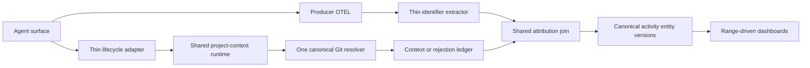

# Canonical Agent Project Attribution Ingestion Plan

## Objective

Establish one canonical live project-attribution pipeline for Codex, Claude Code, and OMP.

A native lifecycle hook supplies an authoritative workspace and producer-native correlation identifier. The shared runtime resolves the Git project once, stores an immutable project-context interval, and the central ingestion pipeline joins source telemetry to that interval using the verified producer identifier and source-event time.

Dashboard queries surface canonical data using only the selected source-event time range. Historical attribution remains a one-off manual operation. No active-generation mechanism, automatic legacy attribution, compatibility path, or superseded implementation remains after cutover.

Anthropic validation is limited to Claude Code. Claude Agent SDK, Cowork, and other Anthropic desktop applications are out of scope.

## Centralized architecture boundary

The implementation is centralized. Differences are permitted only at the producer boundaries listed below.

### Producer-specific boundary

Each surface has a thin adapter responsible only for:

- mapping the native lifecycle event name;
- extracting the native correlation identifier;
- extracting the authoritative workspace;
- recording the native event timestamp or synchronous invocation time;
- invoking the shared runtime with the canonical argument contract.

Each source adapter is responsible only for mapping the producer-native OTEL identifier to `correlation.id`.

### Shared boundary

All other behavior is implemented once:

- Git common-directory resolution;
- canonical project identity derivation;
- context and rejection validation;
- lifecycle state transitions;
- interval persistence;
- source-event attribution;
- late-context reconciliation;
- stable entity versioning;
- OTLP outbox delivery;
- historical writer semantics;
- dashboard query semantics;
- diagnostics and coverage accounting.

No producer adapter may resolve project identity, write producer-specific project records, infer attribution, or implement its own reconciliation behavior.



## Canonical producer normalization

| Surface | Adapter input | OTEL service | Native OTEL ID | Canonical producer | Surface diagnostic |
| --- | --- | --- | --- | --- | --- |
| Codex CLI | notify `thread-id` | `codex_cli_rs` | `thread.id` or `thread_id` | `codex-cli` | `codex-cli` |
| Codex app | app-server thread ID | `codex-app-server` | `thread.id` or `thread_id` | `codex-app-server` | `codex-app` |
| Codex app-server | protocol thread ID | `codex-app-server` | `thread.id` or `thread_id` | `codex-app-server` | `codex-app-server` |
| OMP | `ctx.sessionManager.getSessionId()` | `oh-my-pi` | `gen_ai.conversation.id` | `omp` | `omp` |
| Claude Code | hook `session_id` | `claude-code` | `session.id` | `claude-code` | `claude-code` |

Codex app and app-server intentionally share canonical producer `codex-app-server` because they share the app-server telemetry service and thread namespace. Before implementation, the live proof gate must demonstrate that their thread identifiers are globally collision-safe. If that proof fails, add `codex-app` as a distinct canonical producer everywhere before proceeding; do not add a fallback alias.

When both Codex `thread.id` and `thread_id` occur in one source activity, they must contain the same value. Conflicting values produce a durable rejection.

Correlation keys are always namespaced by canonical producer.

## Canonical project-context contract

Every accepted lifecycle record contains exactly:

```text
producer
producer.surface
correlation.id
lifecycle.event
occurred_at
agent.project.id
agent.project.name
agent.project.root
agent.project.kind = git
```

The shared runtime accepts only Git projects. Non-Git, missing, malformed, inaccessible, ambiguous, and conflicting workspaces are rejected. `non_git` is removed from the accepted session-context schema during cutover.

The shared runtime owns:

- worktree-safe Git common-directory resolution;
- canonical root and display-name selection;
- stable project ID derivation;
- complete-tuple validation;
- deterministic context/rejection event IDs;
- atomic inbox publication;
- duplicate detection;
- quarantine and retry classification.

## Rejection contract

Rejected lifecycle attempts are not left silently in the inbox. They are moved atomically to a quarantine location and persisted as bounded rejection records containing only:

```text
rejection.id
producer
producer.surface
correlation.id when valid
lifecycle.event
occurred_at
reason.code
source.adapter
```

Allowed reason codes are fixed in the canonical schema, including:

```text
missing_correlation_id
conflicting_correlation_id
missing_workspace
invalid_workspace
non_git_workspace
git_resolution_failed
invalid_timestamp
invalid_transition
duplicate_conflict
out_of_order_event
```

Rejection records contain no prompts, responses, tool payloads, environment values, or arbitrary producer content.

## Canonical temporal contract

Attribution is performed at source activity/event granularity, not by assigning one project to an aggregated trace range.

Intervals are half-open:

```text
[started_at, ended_at)
```

Rules:

- `session_start` opens an interval at its timestamp.
- `workspace_changed` closes the current interval and opens its replacement at the same timestamp.
- An activity exactly at the transition timestamp belongs to the replacement interval.
- `session_end` closes the current interval; activity at the end timestamp is outside it.
- A source activity must fall inside exactly one interval for the same producer and correlation ID.
- A trace containing source activities on both sides of a transition is attributed per activity; it is never assigned one project as a whole.

Lifecycle event identity is derived from producer, correlation ID, native event type, native timestamp, and normalized Git root where applicable.

Allowed transitions:

```text
none -> session_start -> workspace_changed* -> session_end
```

Duplicate identical events are idempotent. Conflicting duplicates are quarantined. Events older than the current interval state are retained in an ordered replay queue and processed transactionally. An end or workspace change without a valid start is rejected. Clock skew beyond the configured bound is rejected rather than inferred.

## Canonical activity entity

### Granularity

One canonical activity entity represents one detector observation over one deterministic source membership set. It is not a trace, project, finding, or generation.

### Stable identity

`activity.id` is a deterministic hash of fields that do not depend on attribution:

```text
detector.id
detector.version
normalization.version
sorted source event/log/span IDs
operation kind
normalized target
normalized failure class
```

Project identity, attribution state, scan ID, processing time, and generation ID are excluded.

### Base table

Create `canonical_activities` with immutable fields:

```text
id PRIMARY KEY
producer
producer_surface
correlation_id
source_started_at_ns
source_ended_at_ns
detector_id
detector_version
normalization_version
source_membership_hash
source_membership_json
operation_kind
target_kind
normalized_target
normalized_failure_class
created_at
```

Require unique source membership for a detector/normalization contract. Persist only allowlisted source identifiers and normalized metadata.

### Version table

Create `canonical_activity_versions`:

```text
activity_id REFERENCES canonical_activities
version INTEGER
attribution_state
project_identity_id NULLABLE
attribution_method
attribution_evidence_id NULLABLE
reason_code NULLABLE
created_at
PRIMARY KEY (activity_id, version)
UNIQUE (activity_id, attribution evidence tuple)
```

Versions are monotonic per activity. Version 1 records the first resolved or unresolved state. A new version is inserted only when the canonical attribution tuple changes.

### Reconciliation transaction

When context arrives or changes:

1. identify unresolved activities by `(producer, correlation_id)` and source time;
2. evaluate the half-open interval contract;
3. compare the resolved tuple with the latest activity version;
4. insert exactly one higher version when changed;
5. enqueue one OTLP event in the same SQLite transaction;
6. schedule recomputation for every affected derived aggregate;
7. commit or roll back the entire operation.

Outbox identity is a deterministic hash of `activity.id`, `version`, canonical payload schema version, and event name. Retries reuse the same event ID.

### Findings and trends

Finding membership references `activity.id`, not a particular activity version. Findings and trends are recomputed from the latest activity version after reconciliation.

If project attribution changes grouping:

- emit a higher version marking the superseded finding inactive;
- emit or update the replacement finding under its canonical membership/project key;
- recompute trend state from latest active memberships;
- never leave both findings active for the same canonical membership.

## Decision Gate 1 — Live producer identity proof

Record the installed producer version, command, native lifecycle ID, local artifact ID, OTEL service/field/value, timestamps, counts, and project tuple. Capture identifiers and count-only evidence; never capture prompts or responses.

A surface is unsupported if equality cannot be proven. Stop that surface without adding inference or compatibility logic.

### Claude Code

Use explicit UUIDs:

```bash
claude -p \
  --session-id <uuid> \
  --output-format stream-json \
  --include-hook-events \
  --tools "" \
  "Reply only: OK"
```

Test:

- fresh session in project A;
- fresh session in project B;
- concurrent project-A/project-B sessions;
- resume;
- fork with `--fork-session`;
- session end;
- non-Git rejection;
- workspace change only if `CwdChanged` exists in the installed Claude Code version.

Require:

```text
hook session_id = local artifact session ID = OTEL session.id
```

If `CwdChanged` is unavailable, Claude Code is supported only as a fixed-workspace session. Record that limitation and mark workspace change not applicable; do not infer it. Resume must either preserve the ID and interval or emit a documented new start with a new ID. Fork must create and expose a new ID.

### Codex CLI

Start a fresh CLI session from a known Git root using the installed native hook/notify configuration. Require:

```text
notify thread-id = session_meta.payload.id = OTEL thread.id/thread_id
```

Test fresh, resume, concurrent projects, non-Git, and every supported lifecycle close/change event.

### Codex app

Start a new app workspace and capture the app-server lifecycle thread ID, local session metadata ID, and `codex-app-server` telemetry ID. Repeat with two concurrent workspaces. Prove shared app-server namespace safety before retaining canonical producer `codex-app-server`.

### Codex app-server

Use a bounded protocol fixture:

1. start the app-server locally;
2. call `thread/start` with an explicit Git `cwd`;
3. start one bounded turn;
4. observe thread lifecycle and OTEL;
5. repeat with `thread/resume` and two concurrent threads.

Require protocol thread ID, local session metadata ID, and OTEL ID equality.

### OMP

Start a fresh native OMP session in a known Git root. Require:

```text
getSessionId() = local session record id = OTEL gen_ai.conversation.id
```

Repeat with two concurrent projects where supported, resume, end, and non-Git rejection.

## Decision Gate 2 — Canonical entity and temporal approval

Before code changes, approve:

- activity granularity and stable-ID inputs;
- source membership allowlist;
- version uniqueness;
- half-open interval behavior;
- transition and replay rules;
- rejection schema and retention;
- finding/trend recomputation semantics;
- outbox identity and retry behavior.

Fixtures must prove:

- unresolved activity becomes one higher version with the same ID;
- duplicate context produces no new version;
- conflicting context produces a rejection;
- a trace spanning a workspace transition yields correctly split activities;
- affected findings and trends converge without duplicate active state.

## Phase 1 — Implement centralized identifier extraction

Update source ingestion so each producer-specific extractor returns only:

```text
canonical producer
producer surface
correlation ID
source event timestamp
source provenance IDs
```

Mappings:

```text
codex-cli / codex-app-server:
    one unique value across thread.id and thread_id

omp:
    gen_ai.conversation.id

claude-code:
    session.id
```

Reject missing, multiple, or conflicting IDs. Do not fall back to trace ID, span ID, conversation text, CWD, file path, prompt, or process state.

Tests use retained live proof fixtures plus malformed/conflict cases. Invented fixtures alone cannot establish producer support.

## Phase 2 — Implement canonical activity storage and reconciliation

Add the base/version/recompute schema and shared attribution service described above.

Migrate current observation source membership into canonical activities using deterministic IDs. Produce a manifest mapping every existing observation ID to its canonical activity ID and verify there are no ambiguous collisions.

Normal scans:

- persist canonical base activities once;
- insert latest attribution versions;
- drain context/rejection queues;
- reconcile late context;
- recompute affected findings/trends;
- emit canonical OTLP events;
- never invoke legacy attribution.

## Decision Gate 3 — Remote generation-data disposition

Before removing generation code, inventory all remote rows containing:

- `analysis.generation`;
- generation event scopes;
- `introspection.analysis_generation.activated`;
- generation projection event IDs.

Record counts, exact event-ID sets, timestamps, project tuples, and a checksum in a backup outside automatic import paths.

The selected clean-cutover strategy is bounded purge after canonical replacement:

1. emit the complete canonical replacement population;
2. verify source denominator and stable-ID/project-tuple preservation;
3. prove dashboards return the replacement population only;
4. obtain explicit destructive-operation approval;
5. delete the bounded generation-scoped remote rows using a proven SigNoz/ClickHouse operation;
6. wait for mutation completion;
7. verify zero remaining generation rows and unchanged canonical rows.

If bounded remote deletion is unsupported or cannot be proven safe, stop. Do not retain a dashboard compatibility filter as the final design.

Stored backups may retain historical generation fields for audit, but executable code, live storage, and dashboard queries must not depend on them.

## Phase 3 — Build the one-off legacy writer

This phase must complete before generation removal.

Final command:

```text
agent-introspection legacy-project-attribution run \
  --start <RFC3339> \
  --end <RFC3339> \
  --approved-by <operator>
```

Remove `analysis-reanalyse-attribution` in the same atomic cutover.

The command:

- is never imported or invoked by scheduler or normal scan code;
- accepts only Codex producer-owned session/conversation IDs, timestamps, Git-validated tool workspace/target metadata, and exact source provenance IDs;
- never reads or retains prompts, responses, command output, environment values, or arbitrary nested content;
- enforces configured project roots and a documented maximum bounded range;
- creates one immutable fact set with deterministic identity;
- refuses duplicate application;
- writes canonical activities/activity versions through the shared writer;
- verifies exact outbox and remote IDs;
- reports accepted, rejected, unresolved, and denominator counts.

Existing accepted legacy fact sets and evidence tables remain authoritative inputs until migrated and verified. No generation projection is required.

## Decision Gate 4 — Migration manifest and rehearsal

Create a table-level migration manifest before writing the migration.

| Current object | Target/disposition |
| --- | --- |
| `observations` | map immutable source membership into `canonical_activities` |
| observation attribution fields | migrate into `canonical_activity_versions` |
| `findings` / memberships / trends | rebuild against canonical activity IDs/latest versions |
| session context events/intervals | preserve; rebuild checks for canonical producer/project contract |
| rejection/inbox files | migrate to rejection/quarantine records |
| attribution fact sets/facts | preserve until canonical legacy migration is verified |
| generation projections/links/current/activations | purge remotely, then remove locally |
| pending generation outbox events | cancel before schema cutover; never deliver after canonical replacement |
| delivered canonical outbox events | preserve unchanged |
| staged/unactivated generations | inventory and discard after proving no unique accepted legacy attribution |

The manifest must enumerate every affected column, index, trigger, foreign key, command, asset, and test.

### Rehearsal states

Rehearse on verified database copies containing:

- no generation;
- active generation;
- staged but unactivated generation;
- pending, failed, and delivered outbox rows;
- accepted legacy fact sets;
- unresolved activities;
- open and closed context intervals;
- quarantined lifecycle events.

### Safety gates

Before migration:

- stop scheduler;
- drain canonical inbox/outbox;
- record pending/failed rows;
- create and verify a database backup;
- record table counts, stable-ID sets, project tuples, and content hashes;
- prove the remote purge method separately.

Migration runs in a controlled transaction with foreign keys disabled only where required by a documented rebuild, then re-enabled before commit.

After migration:

- compare exact preserved ID sets and hashes;
- verify accepted legacy project tuples;
- run `integrity_check` and `foreign_key_check`;
- verify indexes and triggers;
- verify zero orphan outbox/evidence rows;
- abort and restore before producer configuration changes on any mismatch.

Historical migration checksums are never edited.

## Phase 4 — Atomic generation and legacy cutover

Generation removal occurs only after:

- canonical entity writer is live and tested;
- one-off legacy writer is live and idempotent;
- accepted historical attribution has canonical replacement events;
- remote generation rows have been backed up and purged;
- migration rehearsal passes.

Delete in one atomic phase:

- `generations.py`;
- stage/activate CLI commands;
- generation compatibility gates;
- generation telemetry attributes/scopes/events;
- active-generation dashboard predicates;
- generation tables, indexes, triggers, and foreign keys;
- generation tests and operational documentation;
- old legacy reanalysis command and generation writer.

No intermediate commit may leave the historical workflow broken.

## Phase 5 — Range-driven dashboard cutover

Dashboard population is selected by source-event timestamp.

For each stable activity in the selected range:

1. select one latest activity version;
2. count it once;
3. count as attributed only when project ID/name are complete;
4. otherwise require exactly one unresolved/rejection reason.

Required invariant:

```text
eligible activities = attributed activities + unresolved activities
```

after deduplication.

Add diagnostics for:

- source sessions;
- accepted context sessions;
- matched sessions;
- project-context records without telemetry;
- telemetry without context;
- coverage by producer and surface;
- attribution method;
- rejection reason;
- context-to-telemetry delay;
- late-context reconciliations.

Validate dashboard SQL against independently queried expected stable-ID sets. Browser verification confirms rendering and range interaction only; it is not the data oracle.

## Phase 6 — Operational rollout

One operator owns the cutover and records every gate.

1. Inventory installed Claude Code, Codex, and OMP versions, configs, managed runtimes, scheduler, inbox, outbox, and dashboard identities.
2. Pause scheduler and prove no active lease.
3. Drain and record canonical inbox/outbox state.
4. Back up and rehearse database migration.
5. Apply migration and verify preservation gates.
6. Install one final versioned managed runtime.
7. Atomically switch one producer configuration at a time.
8. Start a fresh live session for that producer.
9. Verify native ID, local artifact ID, context row, interval, activity version, outbox ID, and remote SigNoz ID.
10. Stop and restore before proceeding if any producer fails.
11. Update the persisted dashboard through its identity-preserving route and relock it.
12. Remove every old config entry, managed runtime, adapter, bridge, and command reference.
13. Restart scheduler.
14. Run post-cutover coverage and denominator-conservation checks.

No dual attribution logic runs during rollout. A prior managed runtime may remain on disk only while ingestion is paused and before configuration is switched; it is removed before scheduler restart.

Search installed configuration for zero references to:

- repository source paths;
- deleted commands;
- prior managed runtime versions;
- external attribution bridges;
- static project values;
- scheduled artifact harvesters;
- automatic legacy workflows.

## Phase 7 — Clean canonical code cutover

Remove every superseded implementation:

- direct trace-CWD attribution;
- direct source-span project tuple as a competing live method;
- thread/conversation project propagation outside the canonical extractor;
- scheduled session artifact harvesting;
- automatic Git tool-workspace attribution;
- active analysis generations;
- producer-specific project resolvers;
- deprecated correlation aliases outside thin extractors;
- compatibility exports and commands;
- stale tests, assets, documentation, and installed configuration.

Retain only:

- one canonical project schema;
- one shared Git resolver;
- thin lifecycle adapters;
- thin telemetry-ID extractors;
- immutable context intervals and rejection ledger;
- one canonical activity/version model;
- one shared producer/correlation/time join;
- one explicit manual legacy writer;
- source-time range dashboards.

## Quantitative acceptance criteria

Use a frozen bounded cutover population and record exact source activity IDs before migration.

Require:

1. Exact eligible stable-ID set equality before and after migration where the population is in scope.
2. `eligible = attributed + unresolved` for the full population and each producer/surface.
3. Exactly one latest version per activity ID.
4. Zero duplicate source membership at the latest version.
5. Exact preservation of accepted legacy activity IDs and project tuples.
6. Exact per-producer counts for hooks, contexts, matched sessions, activities, and rejections.
7. Expected rejection totals by reason.
8. Zero live or selected remote events containing generation fields/scopes/activation events after approved purge.
9. Zero code or dashboard references to generation contracts.
10. Zero normal-scan imports or calls into legacy attribution.
11. Zero installed references to stale runtimes or deleted paths.
12. Fresh Claude Code, Codex, and OMP sessions receive deterministic attribution.
13. Concurrent projects cannot cross-attribute.
14. Late context produces one higher version with the same activity ID and converged findings/trends.
15. Dashboard SQL returns the independently computed stable-ID population for each selected range.

## End-to-end matrix

| Surface | Fresh | Resume | Concurrent projects | Workspace change | End | Non-Git |
| --- | --- | --- | --- | --- | --- | --- |
| Codex CLI | Required | Required | Required | If native hook supports | If native hook supports | Required |
| Codex app | Required | Required | Required | Required | If native hook supports | Required |
| Codex app-server | Required | Required | Required | Required | If protocol supports | Required |
| OMP | Required | Required | Required where supported | If native hook supports | Required | Required |
| Claude Code | Required | Required | Required | Required only when `CwdChanged` is installed; otherwise fixed-workspace limitation | Required | Required |

## Execution order and commit boundaries

1. `test: prove live producer correlation contracts`
2. `feat: add canonical activity attribution schema`
3. `fix: canonicalize producer telemetry identifiers`
4. `refactor: use session context for live attribution`
5. `feat: add canonical one-off legacy attribution`
6. `test: rehearse canonical attribution migration`
7. `refactor: remove generations and old legacy writer`
8. `fix: make dashboards source-range driven`
9. `chore: cut over installed attribution runtime`
10. `chore: remove superseded attribution paths`

Every commit must compile and pass its focused behavioral scenarios. Dependency gates prohibit generation removal before the canonical entity writer, legacy writer, remote replacement/purge, and migration rehearsal are complete.

## Final verification

- focused producer, extractor, interval, rejection, reconciliation, legacy, migration, and dashboard tests;
- full repository quality gates;
- SQLite integrity and foreign-key checks;
- SigNoz health and loopback-only perimeter;
- synthetic OTLP logs, metrics, and traces;
- fresh producer smoke sessions;
- exact ledger/outbox/remote event verification;
- remote generation inventory and zero-row verification after purge;
- dashboard SQL stable-ID comparison;
- browser range and rendering checks;
- clean Git state;
- completion review with zero unresolved issues.
