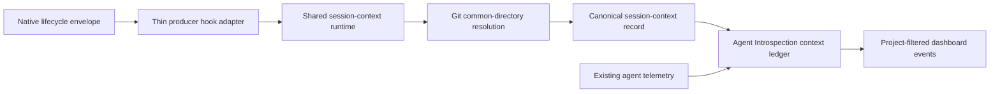

# Deterministic Session-Hook Attribution Design

## Canonical design

One shared runtime owns project resolution and session-context event creation. Thin producer-specific hook adapters only normalize a native lifecycle envelope and invoke that runtime. They never infer project identity, scan artifacts, read prompts, retain arbitrary payloads, or make project-attribution decisions.

The shared runtime accepts exactly:

```text
PRODUCER SESSION_ID EVENT_TYPE OCCURRED_AT WORKSPACE
```

`PRODUCER` is one of `claude-code`, `codex-cli`, `codex-app-server`, or `omp`. `SESSION_ID` is a non-empty single-line native producer session identifier. `EVENT_TYPE` is `session_start`, `workspace_changed`, or `session_end`. `OCCURRED_AT` is an RFC3339 timestamp with an offset. `WORKSPACE` is an existing absolute directory supplied by the native lifecycle envelope.

An adapter fails closed before runtime invocation when any required authoritative value is absent, malformed, ambiguous, or unsupported. If a native envelope has no timestamp, an adapter may capture the synchronous UTC invocation time for `OCCURRED_AT`. It forwards no value beyond the five canonical arguments.



## Shared session-context runtime

The shared runtime validates all five arguments, resolves `WORKSPACE` through Git common-directory semantics, and creates a complete canonical record or nothing. It rejects non-Git, inaccessible, ambiguous, malformed, or partial inputs. It retains no prompt, response, tool input, command, environment data, credential, or arbitrary native payload.

The canonical record contains the event identity, producer, session ID, event type, occurred-at timestamp, and complete Git project tuple. It is written to the managed local session-context inbox. The context ledger consumes accepted records as immutable intervals:

- `session_start` opens an interval.
- `workspace_changed` closes the active interval and opens a replacement interval.
- `session_end` closes the active interval.
- An unknown or invalid context closes attribution rather than retaining prior project context.
- Agent telemetry is associated only when its producer and explicit session correlation key match an active interval.
- No matching context interval leaves telemetry unresolved.

The runtime is the only live project-attribution path.

## Managed installation and configuration

The onboarding skill distributes the shared runtime and producer adapters from its `scripts/` directory into a stable versioned managed directory under `$HOME/.local/lib/agent-introspection`. Hook configuration references only that managed adapter path, never a mutable skill source path, shell alias, prompt fragment, inline command, or static project value.

Managed configuration is producer-specific:

| Producer | Managed native configuration | Native lifecycle mapping | Lifecycle limitation |
|---|---|---|---|
| Claude Code | Configure documented `SessionStart` and `SessionEnd` command hooks. | `SessionStart` → `session_start`; `SessionEnd` → `session_end`; use authoritative native session ID and absolute workspace. | No `workspace_changed` event. |
| Codex | Configure the documented persistent `notify` hook. | `agent-turn-complete` with authoritative `thread-id` and absolute `cwd` → `session_start` on first observation; a changed normalized `cwd` → `workspace_changed`. | `session_end` is unsupported; a notification without the required values emits no event. |
| OMP | Configure the native extension lifecycle callback. | Native `session_start` → `session_start`; native `session_shutdown` → `session_end`; use the extension session ID and absolute `cwd`. | No `workspace_changed` event. |

The Codex adapter invokes the runtime as `codex-cli` only when its authoritative native `notify` envelope satisfies the adapter contract. The shared runtime recognizes all canonical producer values; a producer identity is never inferred from telemetry, process state, request content, or workspace.

## Capability matrix

| Producer | Required authoritative native fields | Accepted event types | Unsupported boundary |
|---|---|---|---|
| Claude Code | `hook_event_name`, session ID, absolute `cwd`; native timestamp when supplied | `SessionStart` → `session_start`; `SessionEnd` → `session_end` | Missing or malformed values; workspace changes are not reported. |
| Codex | `type=agent-turn-complete`, `thread-id`, absolute `cwd`; valid native timestamp when supplied | First observation → `session_start`; changed normalized `cwd` → `workspace_changed` | `session_end` is unsupported; missing, malformed, ambiguous, or non-lifecycle notification values emit no event. |
| OMP | extension session ID and absolute `cwd` | native `session_start` → `session_start`; native `session_shutdown` → `session_end` | Missing, malformed, or ambiguous values emit no event; workspace changes are not reported. |

An unsupported producer event remains unresolved. Prompt hooks, text-only hooks, telemetry CWD, paths, aliases, shell commands, static values, request content, and thread inference are not authoritative inputs.

## Validation

1. Validate the native configuration syntax without triggering a producer or hook.
2. Confirm each managed hook references only its managed adapter path.
3. Confirm each adapter accepts only its documented lifecycle envelope and invokes the shared runtime with observable canonical argv.
4. Start a fresh supported producer session and verify a context record and matching telemetry share the explicit producer/session correlation key.
5. Verify supported workspace transitions create interval replacement without cross-project leakage.
6. Verify unsupported, malformed, or incomplete native envelopes emit no context record and leave telemetry unresolved.
