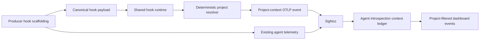

# Deterministic Session-Hook Attribution Design

## Decision required

Use a lightweight, harness-agnostic session-hook protocol to emit explicit project-context events. Shared deterministic code resolves, validates, emits, stores, and correlates context. Each producer supplies only hook scaffolding that maps its supported lifecycle payload into the shared protocol.

No implementation begins until the canonical schema, event contract, and producer capability matrix are approved.

## Design goal

Increase project-attribution coverage without modifying harness binaries, using static process-level OpenTelemetry attributes, a proxy, or reconstructing project identity from arbitrary telemetry.

## Safety model

A hook event is authoritative only when the producer provides both:

1. a stable producer session identifier that also appears in ingested agent telemetry; and
2. the active workspace supplied directly by a session lifecycle payload.

The shared integration resolves project identity from that hook-provided workspace. It never derives identity from raw span CWD fields, paths, prompts, aliases, tool commands, or historical trace patterns.

## Shared deterministic runtime

The shared runtime owns all behavior that must remain identical across harnesses.

### Hook input

Each adapter provides a normalized payload containing:

- producer identifier;
- stable producer session identifier;
- lifecycle event type;
- event timestamp;
- authoritative active workspace.

The runtime rejects absent, malformed, or partial payloads. It records no prompt, response, tool input, command, or credential value.

### Project resolution

The runtime:

1. resolves the hook-provided workspace through Git common-directory semantics;
2. validates the complete canonical project tuple using the repository-owned schema;
3. emits no project context for non-Git, ambiguous, invalid, or inaccessible workspaces;
4. emits a complete tuple or nothing.

### Context events

The runtime emits one OTLP project-context event for each accepted lifecycle event. The planned schema amendment defines the canonical tuple, explicit session correlation key, producer identity, lifecycle event type, and interval semantics. This event is producer-hook evidence, not a copy of arbitrary trace fields.

### Runtime distribution

The onboarding skill owns the canonical runtime process code in its `scripts/` directory. It does not generate producer-specific implementations.

During onboarding, the skill:

1. identifies only producers with a supported authoritative lifecycle-hook payload;
2. copies the versioned shared runtime into the managed local Agent Introspection hook directory;
3. writes or updates the producer's hook configuration so it invokes that managed copy;
4. records the installed runtime identity, producer adapter, hook target, and validation result.

The hook configuration must never invoke a mutable skill source path, prompt fragment, shell alias, or ad hoc inline command. The managed runtime path is stable for the producer, while the onboarding skill remains the canonical distribution source.

## Onboarding workflow replacement

This replaces the producer-implementation workflow that configures or changes each producer to emit the project tuple directly.

It does not replace stack health, producer capability discovery, canonical-schema validation, or end-to-end validation. Those workflows remain required.

The replacement producer-onboarding workflow is:

1. load the canonical session-hook event contract;
2. classify the producer's lifecycle-hook payload and correlation capability;
3. install the managed shared runtime from the onboarding skill;
4. configure the producer adapter and hook target;
5. start a fresh producer session;
6. verify the hook context event and matching agent telemetry arrive with the explicit session correlation key;
7. retain unsupported producers as unresolved.

### Context ledger

Agent Introspection stores accepted context events as immutable session intervals.

- `session_start` opens an interval.
- `workspace_changed` closes the active interval and opens a replacement interval.
- `session_end`, where supported, closes the interval.
- An unknown or ambiguous workspace closes attribution rather than retaining the prior project.
- Raw agent telemetry is associated only when it has the same producer identity and explicit session correlation key within an active interval.
- No matching context interval leaves telemetry unresolved.

## Producer-specific scaffolding

Only this layer varies by harness.

| Producer | Adapter responsibility | Required capability |
|---|---|---|
| Claude Code | Map lifecycle-hook payload to the shared payload and invoke the runtime. | Session ID and workspace in session lifecycle hooks. |
| Codex CLI | Map supported session hook payload to the shared payload and invoke the runtime. | Session ID and workspace exposed by a supported CLI lifecycle hook. |
| Codex Desktop/app-server | Map supported thread/session lifecycle payload to the shared payload and invoke the runtime. | Thread/session ID and active workspace exposed by a supported hook or extension boundary. |
| OMP | Map lifecycle-hook payload to the shared payload and invoke the runtime. | Session ID and workspace in session lifecycle hooks. |
| Any future harness | Add a small adapter only. | The same two authoritative fields. |

A producer without both required fields is unsupported and remains unresolved. A prompt hook, text-only hook, or hook that cannot reach the shared runtime is not sufficient.

## Workspace changes

Project changes are explicit lifecycle transitions, not trace-derived guesses.

- An adapter emits `workspace_changed` only when the harness lifecycle API reports a new active workspace.
- Ordinary shell commands, tool events, CWD fields, and trace content do not create a transition.
- Producers that cannot report workspace changes retain their declared session-start context until a supported end event or an explicit unknown-context transition.
- Coverage reporting distinguishes stable session-start attribution from producers that support explicit workspace transitions.

## Schema and consumer changes

Before implementation, amend the canonical schema to define the session-hook context event and allow explicit producer-session correlation. The existing prohibition on raw `cwd`, path heuristic, alias, prompt, and unbounded thread inference remains intact.

The consumer must validate the event, preserve interval provenance, reject conflicting context, and derive dashboard attribution only through the explicit event/session contract.

## Validation

1. Unit tests cover payload validation, Git resolution, interval transitions, conflict rejection, and unresolved behavior.
2. Each supported producer has a fixture proving its adapter maps authoritative hook fields without prompts or ambient process assumptions.
3. Fresh producer sessions prove a context event and matching raw telemetry arrive in SigNoz with the same explicit session key.
4. Workspace-change-capable producers prove interval replacement without cross-project leakage.
5. Dashboard events prove paired project identity from ledger-backed context only.
6. Coverage reports separate hook-attributed, unresolved, invalid, and unsupported telemetry.

## Acceptance criteria

- Shared runtime behavior is identical for every producer.
- Per-producer work is limited to lifecycle-payload adaptation and runtime invocation.
- No harness binary patch, local fork, static process-level project configuration, proxy, or downstream project inference is required.
- Every accepted attribution has explicit hook-event provenance and session correlation.
- Unsupported or ambiguous producer contexts remain unresolved.
